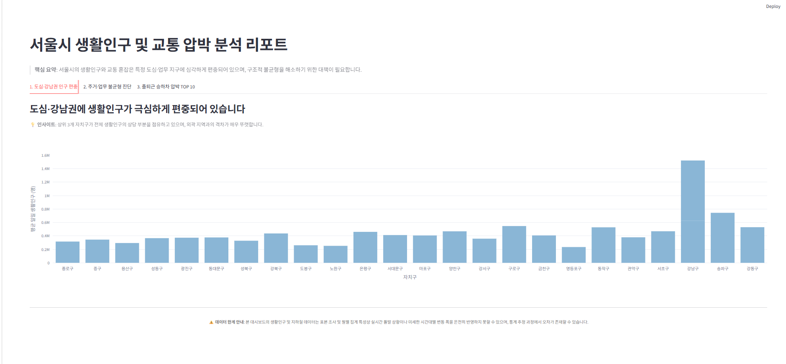
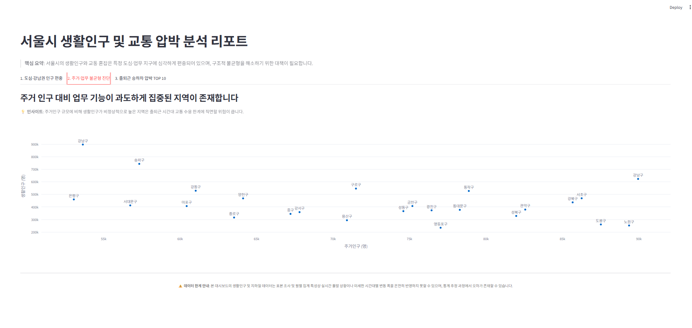
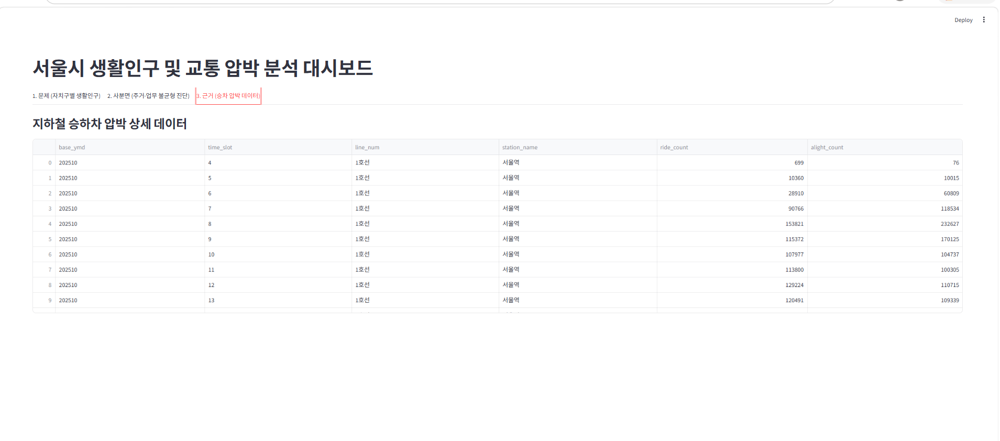

# 서울시 대중교통 및 생활인구 기반 출퇴근 혼잡도 분석 대시보드

## 1. 프로젝트 개요

* 본 프로젝트는 서울시 오픈 API 데이터를 활용하여 단순한 인구 유입 분석을 넘어, 대규모 주거지역(베드타운)의 아침 출근길 승차 압박과 인프라 병목 현상을 진단하는 정책 지향적 데이터 분석 및 시각화 대시보드입니다.
* 단방향 데이터 아키텍처: Collector 모듈이 서울시 오픈 API로부터 데이터를 수집·가공하여 MariaDB에 적재하고, Dashboard는 DB에 접근하여 읽기 전용으로만 데이터를 시각화합니다.
* SCQA 프레임워크 적용: 직관적인 문제 정의를 통해 정책적 시사점을 도출합니다.

## 2. 기술 스택 

 * **Language**: Python 
 * **Database**: MariaDB
 * **Web Framework & Visualization**: Streamlit, Plotly
 * **Data Processing**: Pandas, Numpy
 * **API Integration**: Requests (서울 열린데이터광장 Open API)

## 3. 프로젝트 구조 

```text
mini project/
│
├── app/                  # Streamlit 대시보드 애플리케이션
│   ├── charts.py         # Plotly 시각화 유틸리티 함수 (라인, 바, 산점도 등)
│   ├── components.py     # UI 컴포넌트 모듈
│   ├── main.py           # Streamlit 메인 실행 파일 (SCQA 구조)
│   └── repository.py     # DB 데이터 조회 모듈 (읽기 전용)
│
├── collector/            # 데이터 수집 및 적재 파이프라인
│   ├── sources/          # API 소스별 연동 로직
│   ├── _main_.py         # 수집 파이프라인 실행 진입점
│   ├── client.py         # API 클라이언트 설정
│   ├── config.py         # 환경 설정
│   ├── load_api_to_db.py # API 데이터를 DB로 적재하는 모듈
│   ├── loader.py         # 데이터 로더
│   ├── test_pipeline.py  # 파이프라인 테스트 스크립트
│   └── transform.py      # 수집 데이터 전처리 및 변환
│
├── db/                   # 데이터베이스 스키마 및 쿼리
│   ├── build_mart.sql    # 분석용 마트 테이블 구축 쿼리
│   ├── schema.sql        # 기본 DB 스키마 정의
│   └── seed_dummy.sql    # 더미 시드 데이터
│
├── report/               # 프로젝트 분석 보고서 문서
│   └── report.md
│
├── .env                  # 환경 변수 설정 파일 (API Key, DB 접속 정보)
├── .env.example          # 환경 변수 예시 파일
├── .gitignore            # Git 제외 설정
├── requirements.txt      # 파이썬 패키지 의존성 목록
└── test_pipeline.py      # 전체 파이프라인 검증 스크립트

```

## 4. 데이터 정보 

* **데이터 출처**: 서울 열린데이터광장 오픈 API
* **주요 데이터셋**:
* **지하철 시간대별 승하차 인원 데이터 (`subway_time_table`)**: 역별, 시간대별 승차 및 하차 인원 정보
* **생활인구 데이터 (`flow_population` 등)**: 자치구별 평균 일일 생활인구 규모
* **출근길 승차 압박 지수 마트 (`commute_pressure`)**: 자치구별 인구 대비 출근 시간대 지하철 승차 집중도를 산출한 분석용 마트 데이터 (`pressure`)

## 5. 주요 대시보드 화면 및 기능 소개

본 대시보드는 SCQA 프레임워크를 기반으로 서울시 인구 편중과 교통 혼잡 문제를 입체적으로 진단하기 위해 총 3개의 핵심 뷰로 구성되어 있습니다.

### **1. 도심·강남권 인구 편중 **

* **설명**: 서울시 25개 자치구별 평균 일일 생활인구 분포를 파스텔톤 바 차트로 시각화하여, 특정 도심 및 업무 지구(강남구 등)로 인구가 과도하게 집중되는 현상을 직관적으로 보여줍니다.
* **주요 인사이트**: 상위 자치구와 외곽 지역 간의 체류 인구 격차가 매우 뚜렷하게 나타나며, 도시 자원의 편중을 수치로 증명합니다.
* **화면 예시**:
  

### **2. 주거·업무 불균형 진단 **
* **설명**: 자치구별 주거인구와 실제 생활인구의 상관관계를 산점도 형태로 분석합니다.
* **주요 인사이트**: 주거 인구 규모 대비 생활인구가 비정상적으로 높거나 낮은 지역을 발굴하여, 베드타운의 한계와 업무 기능의 과도한 밀집에 따른 구조적 불균형을 진단합니다.
* **화면 예시**:
  

### **3. 출퇴근 승하차 압박 TOP 10 **
* **설명**: 지하철 시간대별 승하차 데이터를 집계하여 혼잡과 압박이 가장 심한 상위 10개 역사를 순위별 테이블로 도출합니다.
* **주요 인사이트**: 혼잡도가 극심한 특정 병목 지점을 특정함으로써, 향후 대중교통 배차 간격 조정 및 환승 체계 개선 등 실효성 있는 정책적 대안의 근거를 제공합니다.
* **화면 예시**:
  

## 6. 실행 방법 

### 1. 환경 설정 및 라이브러리 설치

프로젝트 루트 디렉토리에서 필요한 패키지를 설치합니다.

```bash
pip install -r requirements.txt

```

### 2. 환경 변수 설정

`.env.example` 파일을 참고하여 `.env` 파일을 생성하고 MariaDB 접속 정보 및 서울시 오픈 API 인증키를 설정합니다.

```env
DB_HOST=localhost
DB_PORT=3306
DB_USER=your_db_user
DB_PASSWORD=your_db_password
DB_NAME=your_db_name
SEOUL_API_KEY=your_seoul_api_key

```

### 3. 데이터베이스 마트 구축

`db/` 폴더 내의 스키마 및 마트 쿼리(`schema.sql`, `build_mart.sql`)를 실행하여 DB 테이블을 생성합니다.

### 4. 데이터 수집 파이프라인 실행 

API로부터 데이터를 수집해 MariaDB에 적재합니다.

```bash
python -m collector._main_

```

### 5. Streamlit 대시보드 실행 

단방향 아키텍처에 따라 DB 데이터를 읽어와 시각화하는 대시보드를 실행합니다.

```bash
streamlit run app/main.py

```